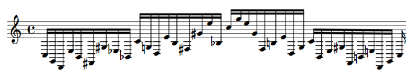
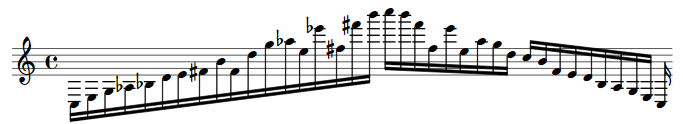
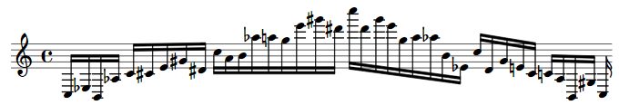

# Symbolic-Music-Generation 🪄🎹
Generating symbolic music with a **Variational AutoEncoder** (VAE). The model is trained with a set of scales and melodic patterns presented by Nicolas Slonimsky in his _Thesaurus of Scales and Melodic Patterns_.

The project revolves around two main ideas:
* Generation of new scales and melodies.
* Interpolating between two scales through the latent space.

<h2>Dataset</h2>
<h2>Generation</h2>
Create new scales through random inputs for the decoder.
<h3>Testing</h3>
Some of our results:

z vector: [-0.0139, -1.2205, -1.4549,  1.5790, -0.5443, -0.4356,  0.9062,  1.4763, 0.9497,  0.1883, -0.4990, -0.5803]

z vector: [-0.5950,  0.3573,  1.1748, -0.3191, -0.0793, -0.6383, -3.7409, -1.8959, 2.5998,  2.3537,  2.8151, -0.5899]

z vector: [ 2.8456, -0.7268, -1.5758, -0.7938,  1.1789, -0.2523,  1.5746,  0.3569, 0.2824,  0.0894,  0.4205, -1.2200]

<h3>Metrics</h3>
<h2>Interpolation</h2>
<h3>Testing</h3>
