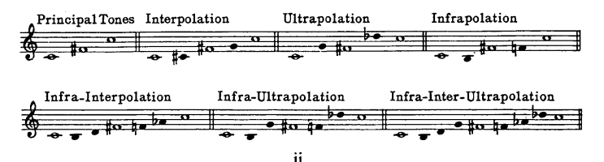

# Symbolic-Music-Generation 🪄🎹
Generating symbolic music with a **Variational AutoEncoder** (VAE). The model is trained with a set of scales and melodic patterns presented by Nicolas Slonimsky in his _Thesaurus of Scales and Melodic Patterns_.

The project revolves around two main ideas:
* Generation of new scales and melodies.
* Interpolating between two scales through the latent space.

<h2>Dataset</h2>
Slonimsky's Thesaurus explores scales beyond their classical definition (Graue, 2024), including scales that span more than a single octave, also disregarding traditional concepts of harmony. These scales are created by dividing one or more octaves into equal parts, such as the tritonal progression, which divides the six tones of an octave into two intervals of three tones. These key notes are referred to as "principal tones".

Based on the principal tones, the thesaurus introduces variations on each progression by adding one to four notes between the intervals, classifying them as interpolation, ultrapolation, or infrapolation, depending on their organization and function within the scale.

* Interpolation: The added note must be located within the principal tone interval that surrounds it.
* Ultrapolation: The added note must be placed above the second note of the principal tone interval that surrounds it.
* Infrapolation: The added note must be placed below the first note of the principal tone interval that surrounds it.

<h2>Generation</h2>
Create new scales through random inputs for the decoder.
<h3>Testing</h3>

To test our model on generating a single scale, you must simply run the `test.py` file in `VAE/Model`, which will decode a random `z` vector.

**EXAMPLE:**
>   example: python3 test.py

  
**Some of our results:**

z vector: [-0.0139, -1.2205, -1.4549,  1.5790, -0.5443, -0.4356,  0.9062,  1.4763, 0.9497,  0.1883, -0.4990, -0.5803]

z vector: [-0.5950,  0.3573,  1.1748, -0.3191, -0.0793, -0.6383, -3.7409, -1.8959, 2.5998,  2.3537,  2.8151, -0.5899]

z vector: [ 2.8456, -0.7268, -1.5758, -0.7938,  1.1789, -0.2523,  1.5746,  0.3569, 0.2824,  0.0894,  0.4205, -1.2200]

<h3>Metrics</h3>
To evaluate our results, we implemented the following metrics:

1.  **KL Divergence:** Measures how a probability distribution differs from another. In this case, it quantifies the difference between the approximate posterior distribution q(z|x) (learned by the encoder) and the prior distribution p(z).
2.  **Sparseness:**
3.  **Coverage:**
4.  **Difference:**

<h2>Interpolation</h2>

We implemented linear interpolation as our main interpolation method, which has shown high efficiency and accuracy, making a smooth transition between the two scales by interpolating between the two `z` vectors in the model's latent space and decoding the resulting transition vectors.

The model's latent space has shown great interpolation results, that have been implemented and tested on two different ways:

1.  over 2 scales: returning the transition scales between one and another.
2.  over 4 scales: returning a grid of scales, having each of the four initial ones on each corner.

<h3>Testing</h3>
<h4>over 2 scales</h4>

To run an interpolation between two `z` vectors, you must run the `interpolate.py` in `VAE/Interpolation`, which will ask to input the 2 vectors to interpolate over. If you wish for one (or both) of the vectors to be random, you must simply input "random" or "" (empty string).

**EXAMPLE:**
> python3 interpolate.py
> 
> Input your first vector of 16 dimensions (example: x1 x2 x3...): random
> 
> Input your second vector of 16 dimensions (example: x1 x2 x3...): -0.0139 -1.2205 -1.4549  1.5790 -0.5443 -0.4356  0.9062  1.4763 0.9497  0.1883 -0.4990 -0.5803

The results will be stored in the `VAE/Interpolation/results/1d` folder.

<h4>4 scales</h4>

Similar to the previous method, you must run `interpolate_2d.py` in the `VAE/Interpolation` folder. You will then be asked to input the 4 vectors to interpolate over. If you wish for any or all vectors to be random, you must simply input "random" or "" (empty string).

**EXAMPLE:**
> python3 interpolate_2d.py
> 
> Enter a vector (z1) in x1 x2 ... format (max 16 values): random
> 
> Enter another vector (z2): -0.0139 -1.2205 -1.4549  1.5790 -0.5443 -0.4356  0.9062  1.4763 0.9497  0.1883 -0.4990 -0.5803
>
> Enter another vector (z3): 
>
> Enter another vector (z4): random

The results will be stored in the `VAE/Interpolation/results/2d` folder.

  
**Some of our results:**
| Header 1 | Header 2 | Header 3 | Header 2 | Header 3 |
|----------|----------|----------|----------|----------|
|  |  |  |  |  | 
|  |  |  |  |  |
|     | b |  | Data 1   | Data 2   |
|    | Data 3   | Data 4   | Data 1   | Data 2   |
|     | Data 1   | Data 2   | Data 1   | Data 2   |
